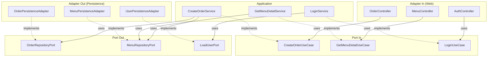

# 🏗️ NCafe 백엔드 헥사고날 아키텍처 가이드

> **Spring Boot + Hexagonal Architecture (Ports & Adapters)**  
> 이 문서는 NCafe 백엔드의 패키지 구조, 각 폴더의 역할, 그리고 계층 간 의존 흐름을 정리합니다.

---

## 📖 목차

1. [헥사고날 아키텍처란?](#1-헥사고날-아키텍처란)
2. [전체 패키지 구조 개요](#2-전체-패키지-구조-개요)
3. [도메인 모듈 구분 기준](#3-도메인-모듈-구분-기준)
4. [3-레이어 상세 설명](#4-3-레이어-상세-설명)
5. [요청 흐름 (Request Flow)](#5-요청-흐름-request-flow)
6. [도메인 모듈별 구조 상세](#6-도메인-모듈별-구조-상세)
7. [공유/인프라 패키지](#7-공유인프라-패키지)
8. [명명 규칙 (Naming Convention)](#8-명명-규칙-naming-convention)
9. [모듈 간 의존 관계](#9-모듈-간-의존-관계)

---

## 1. 헥사고날 아키텍처란?

헥사고날 아키텍처(Hexagonal Architecture)는 **Ports & Adapters** 패턴이라고도 하며, 비즈니스 핵심 로직(Domain)을 외부 기술(DB, Web, 외부 API 등)로부터 완전히 분리하는 설계 방식입니다.

```
        ┌──────────────────────────────────────────────────┐
        │              Adapter (In) - Web                  │
        │         Controller, Request/Response DTO         │
        └──────────────┬───────────────────────────────────┘
                       │ 호출 (UseCase 인터페이스)
        ┌──────────────▼───────────────────────────────────┐
        │             Application (핵심 로직)                │
        │  Port(In):  UseCase 인터페이스                     │
        │  Service:   UseCase 구현체                         │
        │  Port(Out): Repository/외부 Port 인터페이스         │
        │  Command/Result: 입출력 DTO                       │
        └──────────────┬───────────────────────────────────┘
                       │ 호출 (RepositoryPort 인터페이스)
        ┌──────────────▼───────────────────────────────────┐
        │             Adapter (Out) - Persistence          │
        │     JPA Entity, JpaRepository, Adapter 구현체      │
        └──────────────────────────────────────────────────┘

        ┌──────────────────────────────────────────────────┐
        │                  Domain (모델)                    │
        │        순수 POJO — JPA/Spring 의존 없음             │
        │        비즈니스 로직만 포함                           │
        └──────────────────────────────────────────────────┘
```

### 핵심 원칙
- **Domain**은 어떤 프레임워크에도 의존하지 않는 순수 자바 객체
- **Application**은 Domain을 활용한 비즈니스 유스케이스 구현
- **Adapter**는 외부 세계(HTTP, DB 등)와의 연결 담당
- 의존 방향은 항상 **밖 → 안** (Adapter → Application → Domain)

---

## 2. 전체 패키지 구조 개요

```
com.new_cafe.app.backend/
│
├── BackendApplication.java          # Spring Boot 진입점
│
├── ─── 도메인 모듈 (헥사고날 구조) ───
│   ├── order/                       # 주문
│   ├── menu/                        # 메뉴 (고객용 조회)
│   ├── menuoption/                  # 메뉴 옵션
│   ├── category/                    # 카테고리 (고객용 조회)
│   ├── auth/                        # 인증/로그인
│   ├── gallery/                     # 갤러리 이미지
│   ├── notice/                      # 공지/팝업
│   ├── store/                       # 매장 설정
│   ├── sales/                       # 매출/대시보드
│   ├── payment/                     # 결제 검증
│   │
│   ├── user/                        # 사용자 (서브 모듈로 추가 분리)
│   │   ├── profile/                 # 프로필 관리
│   │   ├── grade/                   # 등급 관리
│   │   ├── point/                   # 포인트 관리
│   │   └── favorite/                # 즐겨찾기
│   │
│   └── admin/                       # 관리자 전용 (서브 모듈로 추가 분리)
│       ├── menu/                    # 관리자 메뉴 CRUD
│       ├── category/                # 관리자 카테고리 CRUD
│       ├── grade/                   # 관리자 등급 설정
│       └── user/                    # 관리자 회원 관리
│
├── ─── 공유/인프라 ───
│   ├── config/                      # 전역 설정 (Security, CORS 등)
│   ├── controller/                  # 전역 컨트롤러 (Home, 테스트)
│   └── filter/                      # HTTP 필터 (로깅 등)
```

---

## 3. 도메인 모듈 구분 기준

각 도메인 모듈은 다음 기준으로 분리됩니다:

| 기준 | 설명 | 예시 |
|------|------|------|
| **비즈니스 도메인** | 독립적인 비즈니스 영역 | `order`, `menu`, `auth` |
| **CRUD 주체** | 같은 엔티티라도 고객용/관리자용 분리 | `menu/` (조회) vs `admin/menu/` (CRUD) |
| **응집도** | 관련 기능끼리 같은 모듈로 묶기 | `user/grade`, `user/point`, `user/favorite` |
| **변경 빈도** | 자주 함께 변경되는 기능은 같은 모듈 | `order`의 생성/조회/상태변경 |

### 고객용 vs 관리자용 분리 패턴

이 프로젝트의 독특한 특징은 **동일 엔티티에 대해 고객용(public)과 관리자용(admin)을 별도 모듈로 분리**한 것입니다:

```
menu/        → 고객이 메뉴를 조회하는 기능 (읽기 전용)
admin/menu/  → 관리자가 메뉴를 생성/수정/삭제하는 기능 (CRUD)
```

이렇게 하면:
- 고객용 코드 변경이 관리자 기능에 영향을 주지 않음
- 각각 독립적인 UseCase/Port/Service를 가짐
- 보안 정책을 역할별로 명확히 분리 가능

---

## 4. 3-레이어 상세 설명

각 도메인 모듈은 아래 **3개의 최상위 폴더**로 구성됩니다:

### 4.1 `domain/` — 도메인 모델

```
domain/
└── model/
    ├── Order.java              # 순수 도메인 모델 (POJO)
    ├── OrderItem.java          # 연관 모델
    ├── OrderStatus.java        # Enum
    └── OrderType.java          # Enum
```

**역할:**
- 비즈니스 핵심 엔티티 정의 (순수 자바 객체, JPA 어노테이션 없음)
- 비즈니스 로직 메서드 포함 (예: `Order.changeStatus()`, `Menu.isOrderable()`)
- 프레임워크에 의존하지 않으므로 단위 테스트가 쉬움

**예시 — `Menu.java`:**
```java
@Getter @Builder
public class Menu {
    private Long id;
    private String korName;
    private Integer price;
    private Boolean isAvailable;
    private Boolean isSoldOut;

    // 순수 비즈니스 로직
    public boolean isOrderable() {
        return Boolean.TRUE.equals(isAvailable) && !Boolean.TRUE.equals(isSoldOut);
    }
}
```

---

### 4.2 `application/` — 애플리케이션 계층

```
application/
├── port/
│   ├── in/                         # 인바운드 포트 (UseCase 인터페이스)
│   │   ├── CreateOrderUseCase.java
│   │   ├── GetOrderUseCase.java
│   │   └── ManageOrderStatusUseCase.java
│   └── out/                        # 아웃바운드 포트 (Repository 인터페이스)
│       ├── OrderRepositoryPort.java
│       └── OrderOptionRepositoryPort.java
├── service/                        # UseCase 구현체
│   ├── CreateOrderService.java
│   ├── GetOrderService.java
│   └── ManageOrderStatusService.java
├── command/                        # 입력 DTO (선택적)
│   └── GetMenuDetailCommand.java
└── result/                         # 출력 DTO (선택적)
    └── GetMenuDetailResult.java
```

#### 4.2.1 `port/in/` — 인바운드 포트 (UseCase 인터페이스)

**역할:** 외부(Controller)에서 호출할 수 있는 기능 계약을 정의합니다.

```java
public interface CreateOrderUseCase {
    OrderResponse createOrder(CreateOrderCommand command, String userId);

    // 입력/출력 DTO를 내부 클래스로 정의하는 패턴도 사용
    class CreateOrderCommand { ... }
    class OrderResponse { ... }
}
```

- UseCase 하나 = 하나의 비즈니스 기능 단위
- 네이밍: `{동작}{도메인}UseCase` (예: `CreateOrderUseCase`, `GetMenuListUseCase`)

#### 4.2.2 `port/out/` — 아웃바운드 포트 (Repository 인터페이스)

**역할:** 비즈니스 로직이 필요로 하는 외부 저장소 기능을 인터페이스로 정의합니다.

```java
public interface OrderRepositoryPort {
    Order save(Order order);
    Optional<Order> findById(Long id);
    List<Order> findByUserId(String userId);
    Integer getNextOrderNumber(LocalDate orderDate);
}
```

- Application 계층은 이 인터페이스에만 의존 (구현체를 모름)
- 네이밍: `{도메인}RepositoryPort` 또는 `{동작}{도메인}Port`

#### 4.2.3 `service/` — UseCase 구현체

**역할:** 인바운드 포트(UseCase)를 구현하며, 비즈니스 로직을 조율합니다.

```java
@Service
@RequiredArgsConstructor
public class CreateOrderService implements CreateOrderUseCase {
    private final OrderRepositoryPort orderRepository;       // out port
    private final MenuRepositoryPort menuRepository;         // 다른 모듈의 out port
    private final PaymentVerificationService paymentService; // 다른 모듈 서비스

    @Override
    @Transactional
    public OrderResponse createOrder(CreateOrderCommand command, String userId) {
        // 1. 매장 오픈 여부 확인
        // 2. 금액 계산
        // 3. 결제 검증
        // 4. 주문 저장
        // 5. 포인트 처리
        // 6. 알림 발송
    }
}
```

- 네이밍: `{동작}{도메인}Service` (예: `CreateOrderService`, `GetMenuDetailService`)
- `@Service` + `@Transactional` 적용
- 여러 아웃바운드 포트나 다른 모듈의 포트를 조합하여 비즈니스 흐름 구현

#### 4.2.4 `command/` & `result/` — 입출력 DTO (선택적)

- **`command/`**: 서비스 호출 시 필요한 입력 데이터 객체
- **`result/`**: 서비스 반환 시 사용하는 출력 데이터 객체
- 일부 모듈은 UseCase 인터페이스 내부에 내부 클래스(inner class)로 정의하기도 함

```java
// 별도 파일 패턴 (menu 모듈)
public class GetMenuDetailCommand {
    private Long id;
    private String engName;
}

// 내부 클래스 패턴 (order 모듈)
public interface CreateOrderUseCase {
    class CreateOrderCommand { ... }
    class OrderResponse { ... }
}
```

---

### 4.3 `adapter/` — 어댑터 계층

```
adapter/
├── in/                             # 인바운드 어댑터 (외부 → 내부)
│   └── web/
│       ├── OrderController.java
│       ├── AdminOrderController.java
│       └── dto/
│           ├── StatusRequest.java
│           └── RejectRequest.java
└── out/                            # 아웃바운드 어댑터 (내부 → 외부)
    └── persistence/
        ├── OrderJpaEntity.java
        ├── OrderJpaRepository.java
        └── OrderPersistenceAdapter.java
```

#### 4.3.1 `adapter/in/web/` — 인바운드 Web 어댑터

**역할:** HTTP 요청을 받아서 UseCase를 호출합니다.

```java
@RestController
@RequestMapping("/orders")
@RequiredArgsConstructor
public class OrderController {
    private final CreateOrderUseCase createOrderUseCase;     // UseCase만 의존!
    private final GetOrderUseCase getOrderUseCase;

    @PostMapping
    public ResponseEntity<OrderResponse> createOrder(
            @RequestBody CreateOrderCommand command,
            @AuthenticationPrincipal User user) {
        return ResponseEntity.ok(createOrderUseCase.createOrder(command, userId));
    }
}
```

- Controller는 **UseCase 인터페이스에만 의존** (Service 구현체를 직접 모름)
- HTTP 관련 처리(인증 정보 추출, 응답 코드 결정 등)만 수행
- `dto/`: Controller 전용 Request/Response DTO (웹 계층에서만 사용)

#### 4.3.2 `adapter/out/persistence/` — 아웃바운드 영속성 어댑터

**역할:** 아웃바운드 포트(RepositoryPort)를 구현하여 실제 DB 연동을 수행합니다.

```java
@Component
@RequiredArgsConstructor
public class OrderPersistenceAdapter implements OrderRepositoryPort {
    private final OrderJpaRepository orderRepository;    // Spring Data JPA

    @Override
    public Order save(Order order) {
        OrderJpaEntity entity = toEntity(order);         // Domain → JPA Entity 변환
        OrderJpaEntity saved = orderRepository.save(entity);
        return toDomain(saved);                          // JPA Entity → Domain 변환
    }
}
```

| 파일 | 역할 |
|------|------|
| `*JpaEntity.java` | JPA 엔티티 (`@Entity`, `@Table` 등 JPA 전용) |
| `*JpaRepository.java` | Spring Data JPA 리포지토리 인터페이스 |
| `*PersistenceAdapter.java` | `RepositoryPort` 구현체, Domain ↔ JPA Entity 변환 |

- JPA 관련 코드가 이 폴더에만 존재 → DB 기술 교체 시 이 폴더만 수정
- Domain 모델과 JPA Entity 사이의 **매핑 메서드** (`mapToDomain`, `toEntity`)를 포함

---

## 5. 요청 흐름 (Request Flow)

주문 생성(`POST /orders`)의 전체 흐름을 예시로 설명합니다:

```
[클라이언트 HTTP 요청]
        │
        ▼
┌─ adapter/in/web ──────────────────────────────────────┐
│ OrderController.createOrder()                         │
│  - HTTP 요청 파싱                                      │
│  - 인증 정보(User) 추출                                 │
│  - CreateOrderUseCase.createOrder() 호출               │
└───────────────────────┬───────────────────────────────┘
                        │ (UseCase 인터페이스로 호출)
                        ▼
┌─ application/service ─────────────────────────────────┐
│ CreateOrderService.createOrder()                      │
│  1. getStoreSettingsUseCase.isStoreOpen()  → 매장확인   │
│  2. menuRepository.findById()             → 메뉴조회   │
│  3. paymentVerificationService.verify()   → 결제검증   │
│  4. orderRepository.save()                → 주문저장   │
│  5. userPointUseCase.earnPoints()         → 포인트적립  │
│  6. orderNotificationService.notify()     → 알림발송   │
└───────────────────────┬───────────────────────────────┘
                        │ (RepositoryPort 인터페이스로 호출)
                        ▼
┌─ adapter/out/persistence ─────────────────────────────┐
│ OrderPersistenceAdapter.save()                        │
│  - Domain Order → OrderJpaEntity 변환                  │
│  - OrderJpaRepository.save() (Spring Data JPA)        │
│  - OrderJpaEntity → Domain Order 변환                  │
│  - 결과 반환                                           │
└───────────────────────┬───────────────────────────────┘
                        │
                        ▼
                   [PostgreSQL DB]
```

---

## 6. 도메인 모듈별 구조 상세

### 6.1 `order/` — 주문

| 계층 | 파일 | 설명 |
|------|------|------|
| domain | `Order`, `OrderItem`, `OrderOptionSelection`, `OrderStatus`, `OrderType` | 주문 도메인 모델 및 Enum |
| port/in | `CreateOrderUseCase`, `GetOrderUseCase`, `ManageOrderStatusUseCase` | 주문 생성/조회/상태관리 |
| port/out | `OrderRepositoryPort`, `OrderOptionRepositoryPort` | 주문 DB 접근 인터페이스 |
| service | `CreateOrderService`, `GetOrderService`, `ManageOrderStatusService`, `OrderNotificationService` | 비즈니스 로직 |
| adapter/in | `OrderController`, `AdminOrderController` | 고객용/관리자용 API |
| adapter/out | `OrderPersistenceAdapter`, JPA Entity/Repository | DB 영속화 |

### 6.2 `menu/` — 메뉴 (고객용, 조회 전용)

| 계층 | 파일 | 설명 |
|------|------|------|
| domain | `Menu`, `MenuImage` | 순수 메뉴 모델 (JPA 없음) |
| port/in | `GetMenuDetailUseCase`, `GetMenuListUseCase`, `GetMenuImagesUseCase` | 메뉴 조회 |
| port/out | `MenuRepositoryPort`, `MenuImageRepositoryPort` | 읽기 전용 DB 포트 |
| command | `GetMenuDetailCommand`, `GetMenuListCommand` 등 | 조회 입력 DTO |
| result | `GetMenuDetailResult`, `MenuSummaryResult` 등 | 조회 출력 DTO |
| service | `GetMenuDetailService`, `GetMenuListService` 등 | 조회 로직 |
| adapter/in | `MenuController` | 고객용 메뉴 API |
| adapter/out | `MenuPersistenceAdapter`, `MenuImagePersistenceAdapter` | DB 조회 구현 |

### 6.3 `admin/menu/` — 메뉴 (관리자용, CRUD)

| 계층 | 파일 | 설명 |
|------|------|------|
| port/in | `CreateMenuUseCase`, `UpdateMenuUseCase`, `DeleteMenuUseCase`, `UploadMenuImageUseCase` 등 | 메뉴 생성/수정/삭제/이미지 업로드 |
| port/out | `SaveAdminMenuPort`, `LoadAdminMenuPort`, `DeleteAdminMenuPort` 등 | 관리자 전용 DB 포트 |
| command | `CreateMenuCommand`, `UpdateMenuCommand` 등 | CUD 입력 DTO |
| service | `CreateMenuService`, `UpdateMenuService`, `DeleteMenuService` 등 | 관리자 메뉴 관리 로직 |
| adapter/in | `AdminMenuController`, `AdminBatchMenuController` | 관리자 메뉴 API |
| adapter/out | `AdminMenuPersistenceAdapter`, `AdminMenuJpaEntity` 등 | 별도 JPA Entity로 관리 |

### 6.4 `auth/` — 인증

| 계층 | 파일 | 설명 |
|------|------|------|
| domain | `User` | 사용자 도메인 모델 |
| port/in | `LoginUseCase`, `SignupUseCase`, `GoogleLoginUseCase`, `ManageUserPointUseCase` | 로그인/회원가입/포인트 |
| port/out | `LoadUserPort`, `SaveUserPort` | 사용자 DB 포트 |
| service | `LoginService`, `SignupService`, `GoogleLoginService`, `CustomUserDetailsService` | 인증 로직 |
| adapter/in | `AuthController`, `UserAccountController`, `UserPointController` | 인증 API |
| adapter/out | `UserPersistenceAdapter` | 사용자 DB 구현 |

### 6.5 `category/` — 카테고리 (고객용, 조회)

조회 전용 기능만 포함. CRUD는 `admin/category/`에 위치.

### 6.6 `menuoption/` — 메뉴 옵션

옵션 그룹, 옵션 아이템, 카테고리-옵션 매핑, 메뉴별 옵션 제외 설정 등을 관리.

### 6.7 `gallery/` — 갤러리 이미지

매장 갤러리 이미지 관리. 공개용(`PublicGalleryController`)과 관리용(`AdminGalleryController`)을 분리.

### 6.8 `notice/` — 공지 팝업

공지 팝업의 공개 조회(`NoticePopupController`)와 관리(`AdminNoticePopupController`)를 분리.

### 6.9 `store/` — 매장 설정

영업시간, 매장 상태 등의 설정 관리. 공개 조회(`StoreController`)와 관리(`AdminStoreController`)를 분리.

### 6.10 `sales/` — 매출/대시보드

일별 매출, 메뉴별 매출 통계 등. 관리자 대시보드(`AdminDashboardController`)와 매출 분석(`AdminSalesController`) 포함.

### 6.11 `payment/` — 결제 검증

결제 검증 전용 모듈. 아직 완전한 헥사고날 구조가 아닌 간소화된 형태.

### 6.12 `user/` — 사용자 서브 모듈

| 서브 모듈 | 설명 | 주요 기능 |
|-----------|------|----------|
| `user/profile/` | 프로필 관리 | 닉네임/비밀번호 변경 |
| `user/grade/` | 등급 관리 | 등급 조회, 등급 설정(admin) |
| `user/point/` | 포인트 관리 | 포인트 적립/사용 내역 |
| `user/favorite/` | 즐겨찾기 | 메뉴 즐겨찾기 추가/삭제/조회 |

---

## 7. 공유/인프라 패키지

| 패키지 | 역할 | 주요 파일 |
|--------|------|----------|
| `config/` | 전역 설정 | `SecurityConfig` (Spring Security), `WebConfig` (CORS), `AppConfig`, `DataInitializer` |
| `config/security/` | 인증 관련 | `JwtTokenProvider`, `JwtAuthenticationFilter`, `SecurityBeanConfig` |
| `controller/` | 전역 컨트롤러 | `HomeController` (헬스체크), `CookieTestController` |
| `filter/` | HTTP 필터 | `LogFilter` (요청 로깅), `TestFilter` |

---

## 8. 명명 규칙 (Naming Convention)

### UseCase (Port In) 네이밍

```
{동작}{도메인}UseCase

예:
  CreateOrderUseCase      → 주문 생성
  GetMenuDetailUseCase    → 메뉴 상세 조회
  ManageOrderStatusUseCase → 주문 상태 변경
  ManageFavoriteUseCase   → 즐겨찾기 관리 (추가/삭제 통합)
```

### Service 네이밍

```
{동작}{도메인}Service  (UseCase와 1:1 대응)

예:
  CreateOrderService
  GetMenuDetailService
```

### Port Out 네이밍

```
{도메인}RepositoryPort  또는  {동작}{도메인}Port

예:
  OrderRepositoryPort
  LoadAdminMenuPort
  SaveAdminMenuPort
```

### Adapter 네이밍

```
인바운드:  {역할}{도메인}Controller
           예: OrderController, AdminMenuController

아웃바운드: {도메인}PersistenceAdapter
           예: OrderPersistenceAdapter, MenuPersistenceAdapter
```

### Command / Result 네이밍

```
Command: {동작}{도메인}Command  (입력 DTO)
Result:  {동작}{도메인}Result   (출력 DTO)

예:
  GetMenuDetailCommand  →  GetMenuDetailResult
  CreateMenuCommand     →  CreateMenuResult
```

---

## 9. 모듈 간 의존 관계



### 크로스 모듈 의존 예시

`CreateOrderService`는 여러 모듈의 포트를 주입받아 사용합니다:

| 주입받는 포트/서비스 | 소속 모듈 | 용도 |
|---------------------|----------|------|
| `OrderRepositoryPort` | `order` | 주문 데이터 저장 |
| `MenuRepositoryPort` | `menu` | 메뉴 정보 조회 |
| `MenuOptionRepositoryPort` | `menuoption` | 옵션 가격 계산 |
| `LoadUserPort` | `auth` | 사용자 정보 조회 |
| `GetStoreSettingsUseCase` | `store` | 매장 오픈 여부 확인 |
| `ManageUserPointUseCase` | `auth` | 포인트 적립/사용 |
| `PaymentVerificationService` | `payment` | 결제 검증 |
| `UserGradeService` | `user/grade` | 등급별 적립률 계산 |

> **핵심:** 모듈 간 의존은 항상 **Port(인터페이스)를 통해** 이루어지므로, 구현체 교체 시 다른 모듈에 영향이 없습니다.

---

## 📝 요약

| 폴더 | 위치 | 역할 | 의존 방향 |
|------|------|------|-----------|
| `domain/model/` | 가장 안쪽 | 순수 비즈니스 모델, 로직 | 아무것도 의존하지 않음 |
| `application/port/in/` | 중간 | UseCase 인터페이스 정의 | Domain만 의존 |
| `application/port/out/` | 중간 | Repository 인터페이스 정의 | Domain만 의존 |
| `application/service/` | 중간 | UseCase 구현, 비즈니스 흐름 조율 | Port, Domain 의존 |
| `application/command/` | 중간 | 서비스 입력 DTO | 없음 |
| `application/result/` | 중간 | 서비스 출력 DTO | 없음 |
| `adapter/in/web/` | 가장 바깥 | HTTP 요청 처리, Controller | Port In 의존 |
| `adapter/in/web/dto/` | 가장 바깥 | 웹 전용 Request/Response DTO | 없음 |
| `adapter/out/persistence/` | 가장 바깥 | DB 연동, JPA 구현 | Port Out, Domain 의존 |

**의존 방향: `Adapter` → `Application(Port, Service)` → `Domain`** (항상 안쪽으로만!)
