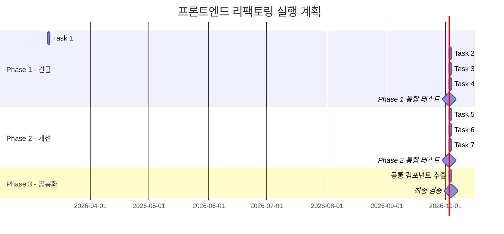

# 🏗️ NCAFE 프론트엔드 리팩토링 청사진

> **작성일**: 2026-03-09  
> **목적**: 컴포넌트화가 미흡한 페이지들을 `admin/menus` 패턴에 맞춰 체계적으로 리팩토링  
> **핵심 규칙**: `hooks/` 폴더는 만들지 않고, 커스텀 훅은 `_components/` 내에 컴포넌트와 함께 배치

---

## 📊 현재 상태 전체 스캔 결과

### 전체 `page.tsx` 파일 크기 맵

| 파일 | 라인 수 | 상태 | 비고 |
|:-----|:------:|:----:|:-----|
| `admin/options/OptionGroupManager.tsx` | **527** | 🔴 긴급 | 단일 컴포넌트 최대 |
| `admin/orders/page.tsx` | **428** | 🔴 긴급 | 인라인 스타일 다수 |
| `admin/page.tsx` (대시보드) | **402** | 🔴 긴급 | 6개 섹션 혼합 |
| `admin/sales/page.tsx` | **374** | 🔴 긴급 | 차트 3종 + 테이블 혼합 |
| `menus/[id]/page.tsx` (고객) | **331** | 🟡 개선 | 옵션선택 + 장바구니 |
| `app/page.tsx` (홈) | **283** | 🟡 개선 | 히어로 + 섹션들 |
| `order/[date]/[number]/page.tsx` | **259** | 🟡 개선 | 주문추적 단일 파일 |
| `order/confirm/page.tsx` | **187** | 🟢 양호 | 구조 괜찮음, 핸들러만 분리 가능 |
| `cart/page.tsx` | **138** | 🟢 양호 | zustand 스토어 활용 |
| `order/my/page.tsx` | **132** | 🟢 양호 | 적절한 수준 |
| `admin/categories/[id]/options` | **123** | 🟢 양호 | |
| `menus/page.tsx` | **78** | ✅ 우수 | 잘 분리됨 |
| `admin/menus/[id]/edit/page.tsx` | **79** | ✅ 우수 | |
| `admin/menus/[id]/page.tsx` | **55** | ✅ 우수 | |
| `admin/menus/new/page.tsx` | **54** | ✅ 우수 | |
| `login/page.tsx` | **42** | ✅ 우수 | |
| `signup/page.tsx` | **41** | ✅ 우수 | |
| `admin/menus/page.tsx` | **38** | ✅ 모범 | **이 구조를 따름** |
| `admin/options/page.tsx` | **16** | ✅ 모범 | |
| `admin/users/page.tsx` | **14** | ✅ 모범 | |

### 기존 잘 구성된 컴포넌트 자산

현재 이미 존재하는 컴포넌트 인프라로, 리팩토링 시 활용 가능합니다:

```
components/
├── common/           ← 기존 공통 컴포넌트
│   ├── Button/
│   ├── Card/
│   ├── Header/
│   ├── ImageUploader/
│   ├── Input/
│   └── index.ts
├── auth/             ← LoginForm, SignupForm 등
├── chat/             ← ChatWidget
└── menu/             ← CategoryTabs, MenuCard, MenuList, types.ts
```

---

## ✅ 모범 사례 분석: `admin/menus`

```
admin/menus/
├── page.tsx                    ← 38줄 ✅ (조합만 담당)
├── page.module.css
├── _components/
│   ├── CategoryList.jsx
│   ├── CategoryTabs/
│   │   ├── CategoryTabs.tsx
│   │   ├── CategoryTabs.module.css
│   │   ├── CategoryManageModal.tsx
│   │   ├── CategoryManageModal.module.css
│   │   └── useAdminCategories.ts    ← 🎯 훅이 컴포넌트와 같은 위치!
│   ├── MenuActionBar/
│   │   └── MenuActionBar.tsx
│   ├── MenuCard/
│   │   ├── MenuCard.tsx
│   │   └── MenuCard.module.css
│   ├── MenuForm/
│   │   ├── MenuForm.tsx
│   │   ├── MenuForm.module.css
│   │   ├── FormField.tsx
│   │   ├── FormField.module.css
│   │   └── sections/
│   │       ├── BasicInfoSection.tsx
│   │       ├── ImageSection.tsx
│   │       ├── MenuOptionField.tsx
│   │       ├── OptionSection.tsx
│   │       └── StatusSection.tsx
│   └── MenuList/
│       └── MenuList.tsx
├── [id]/
│   ├── page.tsx                ← 55줄 ✅
│   ├── page.module.css
│   └── _components/
│       ├── MenuDetailGallery/
│       │   ├── MenuDetailGallery.tsx
│       │   ├── MenuDetailGallery.module.css
│       │   └── useMenuImages.ts         ← 🎯 훅이 컴포넌트 폴더 안에!
│       ├── MenuDetailHeader/
│       ├── MenuDetailInfo/
│       │   ├── MenuDetailInfo.tsx
│       │   ├── MenuDetailInfo.module.css
│       │   └── useMenuDetail.ts         ← 🎯 훅이 컴포넌트 폴더 안에!
│       └── MenuDetailOptions/
├── [id]/edit/
└── new/
```

> [!IMPORTANT]
> **핵심 패턴 3가지**
> 1. `page.tsx`는 **40줄 이내** — 컴포넌트 import + 조합만
> 2. **폴더 단위 컴포넌트** — `컴포넌트/컴포넌트.tsx + .module.css`
> 3. **커스텀 훅은 `_components/` 내에 배치** — 별도 `hooks/` 폴더 ❌

---

## 🔧 리팩토링 대상 7개 & 실행 계획

### Phase 1: 🔴 관리자 핵심 페이지 (최우선)

---

#### 📋 Task 1: `admin/orders/page.tsx` (428줄 → ~40줄)

**현재 문제점:**
- 주문 목록, 카드, 상세 모달, 거절 모달, API 로직이 **단일 파일**
- 인라인 스타일이 **상세 모달 영역**에서 대량 사용
- 타입 정의가 파일 상단에 인라인으로 존재

**리팩토링 후 구조:**
```
admin/orders/
├── page.tsx                          ← ~40줄 (조합만)
├── page.module.css
├── types.ts                          ← OrderStatus, OrderListItem, OrderFull
└── _components/
    ├── useAdminOrders.ts             ← fetchOrders, handleStatusChange, handleReject
    ├── OrderTabs/
    │   ├── OrderTabs.tsx             ← 상태 필터 탭 (ALL/PREPARING/COMPLETED...)
    │   └── OrderTabs.module.css
    ├── OrderCard/
    │   ├── OrderCard.tsx             ← 개별 주문 카드 (현재 L198~275 추출)
    │   └── OrderCard.module.css
    ├── OrderDetailModal/
    │   ├── OrderDetailModal.tsx      ← 주문 상세 모달 (현재 L280~394 추출)
    │   └── OrderDetailModal.module.css  ← ⚠️ 인라인 스타일 → CSS Module 전환
    └── OrderRejectModal/
        ├── OrderRejectModal.tsx      ← 거절 사유 입력 모달 (현재 L395~424 추출)
        └── OrderRejectModal.module.css
```

**세부 작업 체크리스트:**
- [ ] `types.ts` 추출 — `OrderStatus`, `OrderListItem`, `OrderFull`, `TABS` 상수
- [ ] `useAdminOrders.ts` 추출 — `orders/loading/selectedOrder` 상태 + `fetchOrders`, `fetchOrderDetail`, `handleStatusChange`, `handleReject` + 30초 자동갱신 interval
- [ ] `OrderTabs` 컴포넌트 — Props: `activeTab, orderCount, isRefreshing, onTabChange, onRefresh`
- [ ] `OrderCard` 컴포넌트 — Props: `order, isSelected, onClick, onStatusChange, onRejectClick`
- [ ] `OrderDetailModal` 컴포넌트 — **인라인 스타일 전량 CSS Module로 전환** ⚠️
- [ ] `OrderRejectModal` 컴포넌트 — Props: `rejectReason, isRejecting, onReasonChange, onCancel, onConfirm`
- [ ] `page.tsx` 재작성 — 컴포넌트 조합만 수행
- [ ] 기능 동작 검증

---

#### 📋 Task 2: `admin/sales/page.tsx` (374줄 → ~40줄)

**현재 문제점:**
- Recharts 라인차트, 파이차트, 테이블 3종이 **하나의 파일**에
- 기간 제어(일/주/월 + 날짜 이동) 로직이 컴포넌트와 혼합
- `date-fns` 유틸리티 함수들이 inline으로 사용

**리팩토링 후 구조:**
```
admin/sales/
├── page.tsx                          ← ~40줄 (조합만)
├── page.module.css
├── types.ts                          ← SalesSummary, MenuRanking, SalesChartData, SalesPeriod
└── _components/
    ├── useSalesData.ts               ← fetch 4종 병렬, handlePrev/Next, categoryData 계산
    ├── SalesPeriodControl/
    │   ├── SalesPeriodControl.tsx     ← 일/주/월 토글 + 날짜 네비게이션
    │   └── SalesPeriodControl.module.css
    ├── SalesStatsGrid/
    │   ├── SalesStatsGrid.tsx        ← 통계 카드 4개 (매출/주문/객단가/회원비율)
    │   └── SalesStatsGrid.module.css
    ├── SalesLineChart/
    │   ├── SalesLineChart.tsx        ← Recharts 매출 추이 (LineChart)
    │   └── SalesLineChart.module.css
    ├── OrdersTable/
    │   ├── OrdersTable.tsx           ← 완료된 주문 내역 테이블
    │   └── OrdersTable.module.css
    ├── MenuRankingTable/
    │   ├── MenuRankingTable.tsx      ← 상품별 판매 순위 테이블
    │   └── MenuRankingTable.module.css
    └── CategoryPieChart/
        ├── CategoryPieChart.tsx      ← 카테고리별 매출 파이 차트
        └── CategoryPieChart.module.css
```

**세부 작업 체크리스트:**
- [ ] `types.ts` 추출 — `SalesSummary`, `MenuRanking`, `SalesChartData`, `SalesOrderItem`, `SalesPeriod`
- [ ] `useSalesData.ts` 추출 — `period/currentDate/activeTab/summary/chartData/orders/menuRanking` 상태 + `fetchData` (Promise.all 4개), `handlePrev/Next`, `categoryData` (useMemo), `isNextDisabled`
- [ ] `SalesPeriodControl` — Props: `period, currentDate, isNextDisabled, onPeriodChange, onResetDate, onPrev, onNext`
- [ ] `SalesStatsGrid` — Props: `summary`
- [ ] `SalesLineChart` — Props: `data` (SalesChartData[])
- [ ] `OrdersTable` — Props: `orders`
- [ ] `MenuRankingTable` — Props: `ranking`
- [ ] `CategoryPieChart` — Props: `data` ({name, value}[])
- [ ] `page.tsx` 재작성
- [ ] 기능 동작 검증

---

#### 📋 Task 3: `admin/page.tsx` 대시보드 (402줄 → ~50줄)

**현재 문제점:**
- 매장 열기/닫기, 통계, 최근 주문, 인기 메뉴, 빠른 작업, 영업시간 설정이 **전부 한 파일**
- inline으로 정의된 `StatCard` 컴포넌트
- 3개의 API (`adminStoreAPI`, `adminDashboardAPI`, `adminSalesAPI`)를 사용

**리팩토링 후 구조:**
```
admin/
├── page.tsx                          ← ~50줄 (조합만)
├── page.module.css
├── types.ts                          ← StoreStatus, DashboardStats, RecentOrder, PopularMenu
└── _components/
    ├── AdminHeader/                  (기존 유지)
    ├── AdminSidebar/                 (기존 유지)
    ├── useDashboard.ts               ← fetchStoreStatus, fetchStats, fetchRecentOrders,
    │                                    fetchPopularMenus, handleToggleStatus, handleUpdateSettings
    ├── StoreStatusBanner/
    │   ├── StoreStatusBanner.tsx     ← 매장 ON/OFF 배너 + 토글 버튼
    │   └── StoreStatusBanner.module.css
    ├── DashboardStatsGrid/
    │   ├── DashboardStatsGrid.tsx    ← 통계 카드 4개 (메뉴/주문/매출/고객)
    │   ├── DashboardStatsGrid.module.css
    │   └── StatCard.tsx              ← 현재 파일 하단의 재사용 가능 StatCard 추출
    ├── RecentOrdersList/
    │   ├── RecentOrdersList.tsx      ← 최근 주문 5건 목록 + "전체보기" 링크
    │   └── RecentOrdersList.module.css
    ├── PopularMenusList/
    │   ├── PopularMenusList.tsx      ← 인기 메뉴 TOP5
    │   └── PopularMenusList.module.css
    ├── QuickActions/
    │   ├── QuickActions.tsx          ← 빠른 작업 (메뉴등록/관리/주문관리/매출분석)
    │   └── QuickActions.module.css
    └── StoreSettings/
        ├── StoreSettings.tsx         ← 영업 시간 설정 폼 (오픈/마감 + 저장)
        └── StoreSettings.module.css
```

**세부 작업 체크리스트:**
- [ ] `types.ts` 추출 — `StoreStatus`, `DashboardStats`, `DashboardRecentOrder`, `DashboardPopularMenu`
- [ ] `useDashboard.ts` 추출 — 모든 fetch + 상태관리 + 토글/설정 핸들러
- [ ] `StoreStatusBanner` — Props: `status, onToggle`
- [ ] `DashboardStatsGrid` + `StatCard` — Props: `stats, period`
- [ ] `RecentOrdersList` — Props: `orders`
- [ ] `PopularMenusList` — Props: `menus`
- [ ] `QuickActions` — 데이터가 정적이므로 Props 없음
- [ ] `StoreSettings` — Props: `openTime, closeTime, isUpdating, onOpenTimeChange, onCloseTimeChange, onSave`
- [ ] `page.tsx` 재작성
- [ ] 기능 동작 검증

---

#### 📋 Task 4: `OptionGroupManager.tsx` (527줄 → ~100줄)

**현재 문제점:**
- **프로젝트 전체에서 가장 큰 단일 컴포넌트**
- CRUD 로직 (그룹/항목 생성·수정·삭제·연결) + 모달 3개 + 카드 렌더링이 **하나의 컴포넌트**
- 2단계 폴더 구조 필요 (`_components` → `OptionGroupManager` → `_components`)

**리팩토링 후 구조:**
```
admin/options/
├── page.tsx                          ← 16줄 (기존 유지, 이미 적절)
├── page.module.css
└── _components/
    ├── OptionGroupManager.tsx        ← ~100줄 (조합만으로 축소)
    ├── OptionGroupManager.module.css
    ├── types.ts                      ← OptionItem, OptionGroup, GroupFormData, ItemFormData
    ├── useOptionGroups.ts            ← fetchGroups, handleSaveGroup, handleDeleteGroup,
    │                                    handleSaveItem, handleDeleteItem, handleLinkGroup
    ├── OptionGroupCard/
    │   ├── OptionGroupCard.tsx       ← 그룹 카드 + 항목 리스트 렌더링
    │   └── OptionGroupCard.module.css
    ├── GroupFormModal/
    │   ├── GroupFormModal.tsx         ← 그룹 생성/수정 모달 (이름, 최소/최대선택, 필수)
    │   └── GroupFormModal.module.css
    ├── LinkGroupModal/
    │   ├── LinkGroupModal.tsx         ← 기존 그룹 연결 모달
    │   └── LinkGroupModal.module.css
    └── ItemFormModal/
        ├── ItemFormModal.tsx          ← 옵션 항목 추가/수정 모달 (이름, 금액, 가용)
        └── ItemFormModal.module.css
```

**세부 작업 체크리스트:**
- [ ] `types.ts` 추출 — `OptionItem`, `OptionGroup`, `GroupFormData`, `ItemFormData`
- [ ] `useOptionGroups.ts` 추출 — 모달 상태 관리 + CRUD 전부
- [ ] `OptionGroupCard` — Props: `group, onEditGroup, onDeleteGroup, onAddItem, onEditItem, onDeleteItem`
- [ ] `GroupFormModal` — Props: `editingGroup, onClose, onSave`
- [ ] `LinkGroupModal` — Props: `existingGroups, onClose, onLink`
- [ ] `ItemFormModal` — Props: `editingItem, onClose, onSave`
- [ ] `OptionGroupManager.tsx` 재작성 (조합만)
- [ ] 기능 동작 검증

---

### Phase 2: 🟡 고객 페이지 (2차)

---

#### 📋 Task 5: `menus/[id]/page.tsx` 고객 메뉴 상세 (331줄 → ~50줄)

**현재 문제점:**
- 메뉴 fetch, 옵션 그룹 fetch, 옵션 선택 로직, 총액 계산, 장바구니 추가가 **한 파일**
- 옵션 선택 UI가 복잡한 조건 분기 포함

**리팩토링 후 구조:**
```
menus/[id]/
├── page.tsx                          ← ~50줄
├── page.module.css
└── _components/
    ├── useMenuDetail.ts              ← fetch + 옵션 toggle + 총가격 계산 + addToCart
    ├── MenuDetailHero/
    │   ├── MenuDetailHero.tsx        ← 이미지 + 이름 + 설명 + 기본 가격
    │   └── MenuDetailHero.module.css
    ├── MenuOptionSelector/
    │   ├── MenuOptionSelector.tsx    ← 옵션 그룹별 체크박스/라디오 선택 UI
    │   └── MenuOptionSelector.module.css
    └── AddToCartBar/
        ├── AddToCartBar.tsx          ← 수량 조절 +/- 버튼 + "N원 담기" 하단 고정바
        └── AddToCartBar.module.css
```

**세부 작업 체크리스트:**
- [ ] `useMenuDetail.ts` 추출 — `menu/loading/quantity/selectedOptions` 상태 + `fetchDetail`, `handleOptionToggle`, `calculateTotalPrice`, `handleAddToCart`
- [ ] `MenuDetailHero` — Props: `menu`
- [ ] `MenuOptionSelector` — Props: `optionGroups, selectedOptions, onToggle`
- [ ] `AddToCartBar` — Props: `quantity, totalPrice, onQuantityChange, onAddToCart`
- [ ] `page.tsx` 재작성
- [ ] 기능 동작 검증 (옵션 선택 → 가격 계산 → 장바구니 추가 플로우)

---

#### 📋 Task 6: `order/[date]/[number]/page.tsx` 주문 추적 (259줄 → ~40줄)

**현재 문제점:**
- 주문 데이터 fetch, 실시간 폴링, 상태 시각화, 주문 상세, 메타 정보가 **단일 파일**

**리팩토링 후 구조:**
```
order/[date]/[number]/
├── page.tsx                          ← ~40줄
├── page.module.css
└── _components/
    ├── useOrderTracking.ts           ← fetch + 10초 폴링 + statusStep 계산
    ├── OrderStatusHeader/
    │   ├── OrderStatusHeader.tsx     ← 상태별 아이콘/메시지 + 진행 단계 바
    │   └── OrderStatusHeader.module.css
    ├── OrderItemsList/
    │   ├── OrderItemsList.tsx        ← 주문 메뉴 + 옵션 + 총 결제 금액
    │   └── OrderItemsList.module.css
    └── OrderInfoSection/
        ├── OrderInfoSection.tsx      ← 주문번호, 주문일시, 주문자명, 요청사항, 취소사유
        └── OrderInfoSection.module.css
```

**세부 작업 체크리스트:**
- [ ] `useOrderTracking.ts` 추출 — `order/loading/error` 상태 + `fetchOrder` (10초 폴링, 완료/거절 시 중단) + `getStatusStep`
- [ ] `OrderStatusHeader` — Props: `status, statusStep`
- [ ] `OrderItemsList` — Props: `items, totalPrice`
- [ ] `OrderInfoSection` — Props: `order`
- [ ] `page.tsx` 재작성
- [ ] 기능 동작 검증 (폴링이 정상 작동하는지 확인)

---

#### 📋 Task 7: `app/page.tsx` 홈페이지 (283줄 → ~40줄)

**현재 문제점:**
- 히어로 슬라이더(자동 재생), 카테고리 그리드, 특징 소개, 푸터가 **전부 한 파일**

**리팩토링 후 구조:**
```
app/
├── page.tsx                          ← ~40줄
├── page.module.css
└── _components/
    ├── HeroSlider/
    │   ├── HeroSlider.tsx            ← 자동 재생 이미지 슬라이더 + CTA 버튼
    │   └── HeroSlider.module.css
    ├── CategorySection/
    │   ├── CategorySection.tsx       ← 카테고리별 퀵 네비게이션 그리드
    │   └── CategorySection.module.css
    └── FeatureSection/
        ├── FeatureSection.tsx        ← 서비스 특징 3종 (스마트오더/실시간/혜택)
        └── FeatureSection.module.css
```

**세부 작업 체크리스트:**
- [ ] `HeroSlider` — 슬라이드 데이터 + 5초 자동 전환 + 인디게이터 도트
- [ ] `CategorySection` — 카테고리 아이콘 + 이름 + 링크
- [ ] `FeatureSection` — 특징 데이터 배열 + 아이콘 + 설명
- [ ] `page.tsx` 재작성 (푸터는 그대로 page.tsx에 유지하거나 별도 Footer 컴포넌트로 분리)
- [ ] 기능 동작 검증

---

## 🔵 Phase 3: 공통 컴포넌트 추출 (후행 작업)

Phase 1~2 완료 후, 중복 패턴을 `components/common/`으로 추출합니다.

> [!NOTE]
> 기존에 `components/common/`에 `Button`, `Card`, `Header`, `Input`, `ImageUploader`가 이미 있습니다.
> 리팩토링 과정에서 발견되는 공통 패턴만 추가합니다.

```
components/common/              (기존)
├── Button/                     ✅ 이미 있음
├── Card/                       ✅ 이미 있음
├── Header/                     ✅ 이미 있음
├── ImageUploader/              ✅ 이미 있음
├── Input/                      ✅ 이미 있음
│
│   (Phase 3에서 추가)
├── StatusBadge/                ← admin/orders + order tracking + dashboard 에서 중복
│   ├── StatusBadge.tsx
│   └── StatusBadge.module.css
├── StatCard/                   ← dashboard + sales 에서 중복
│   ├── StatCard.tsx
│   └── StatCard.module.css
├── EmptyState/                 ← 거의 모든 리스트 페이지에서 중복
│   ├── EmptyState.tsx
│   └── EmptyState.module.css
├── Modal/                      ← admin/orders + admin/options 에서 중복
│   ├── Modal.tsx
│   └── Modal.module.css
└── PeriodSelector/             ← dashboard + sales 에서 중복
    ├── PeriodSelector.tsx
    └── PeriodSelector.module.css
```

---

## 📐 리팩토링 규칙 (전 작업 공통)

### 구조 규칙

| # | 규칙 | 설명 |
|:-:|:-----|:-----|
| 1 | **page.tsx는 40줄 이내** | 컴포넌트 import + 조합만, 비즈니스 로직 ❌ |
| 2 | **폴더 단위 컴포넌트** | `컴포넌트명/컴포넌트.tsx + .module.css` |
| 3 | **커스텀 훅은 `_components/` 내에** | `hooks/` 폴더 만들지 않음, 컴포넌트와 같은 레벨에 배치 |
| 4 | **타입은 `types.ts`로 분리** | 해당 페이지 폴더 루트에 배치 |
| 5 | **모달은 반드시 독립 컴포넌트** | 별도 폴더로 분리 |
| 6 | **인라인 스타일 ❌** | `style={{...}}` 전량 CSS Module로 전환 |
| 7 | **`_components` 컨벤션** | Next.js App Router 라우팅 제외를 위해 `_` prefix |

### 커스텀 훅 설계 원칙

```typescript
// ✅ 좋은 예 — 훅이 상태와 액션을 모두 반환
export function useAdminOrders(activeTab: string) {
    const [orders, setOrders] = useState([]);
    const [loading, setLoading] = useState(true);
    
    const fetchOrders = useCallback(async () => { ... }, [activeTab]);
    const handleStatusChange = async (id, status) => { ... };
    
    useEffect(() => { fetchOrders(); }, [fetchOrders]);
    
    return { orders, loading, fetchOrders, handleStatusChange };
}

// ❌ 나쁜 예 — page.tsx에서 직접 API 호출
export default function Page() {
    const [orders, setOrders] = useState([]);
    useEffect(() => { fetchAPI('/orders').then(setOrders); }, []);  // ❌
}
```

### import 순서 컨벤션

```typescript
// 1. React / Next.js
import React from 'react';
import Link from 'next/link';

// 2. 외부 라이브러리
import { Coffee, Clock } from 'lucide-react';
import toast from 'react-hot-toast';

// 3. 내부 유틸/API
import { fetchAPI } from '@/app/lib/api';

// 4. 커스텀 훅
import { useAdminOrders } from './_components/useAdminOrders';

// 5. 컴포넌트
import { OrderTabs } from './_components/OrderTabs/OrderTabs';
import { OrderCard } from './_components/OrderCard/OrderCard';

// 6. 스타일
import styles from './page.module.css';

// 7. 타입 (필요 시)
import type { OrderListItem } from './types';
```

---

## 🔄 실행 순서 & 일정 권장



> [!CAUTION]
> **각 Task 완료 후 반드시 기능 검증을 수행하세요.** 컴포넌트 분리 자체가 로직 변경은 아니므로, 리팩토링 전후로 **동작이 100% 동일해야** 합니다.

---

## 📈 기대 효과 요약

| 지표 | Before | After |
|:-----|:------:|:-----:|
| **최대 단일 파일 크기** | 527줄 | ~100줄 |
| **page.tsx 평균 크기** | 380줄 | ~45줄 |
| **인라인 스타일** | 다수 존재 | 0개 (CSS Module 전환) |
| **커스텀 훅 활용** | 1개 (`useAdminCategories`) | **7개 추가** |
| **재사용 가능 컴포넌트** | 5개 (common/) | **5 + 5~6 공통 추가** |
| **코드 탐색 용이성** | 파일명으로 기능 파악 불가 | **폴더명 = 기능명** |
