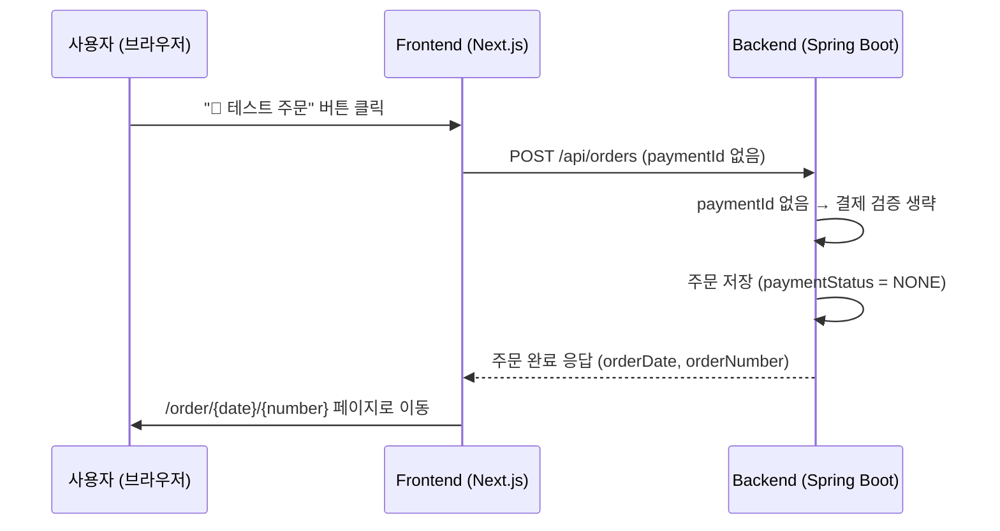
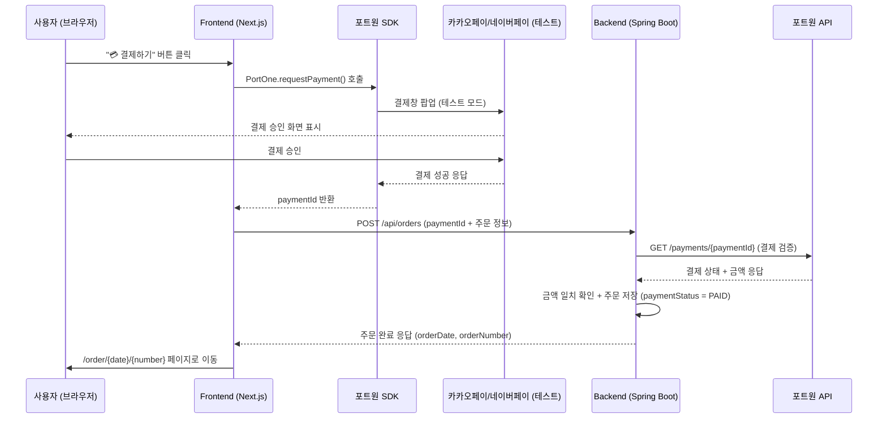

# 포트원(PortOne) 결제 연동 청사진 — 카카오페이 / 네이버페이 (테스트 모드)

> **목표:** NCafe 프로젝트에 포트원(V2)을 연동하여 **카카오페이**와 **네이버페이** 결제 테스트 환경을 구축합니다.
> 실제 과금은 발생하지 않으며, 포트원 테스트 모드에서 제공하는 가상 결제만 사용합니다.

---

## 📌 현재 프로젝트 흐름 분석

### 🔀 듀얼 모드 컨셉

주문 확인 페이지(`/order/confirm`)에서 **두 가지 주문 방식**을 동시에 제공합니다:

| 버튼 | 설명 | 결제 여부 | 용도 |
| :--- | :--- | :--- | :--- |
| **🧪 테스트 주문** | 기존 방식 그대로, 결제 없이 즉시 주문 생성 | ❌ 없음 | 주문/관리자 기능 빠르게 테스트 |
| **💳 결제하기** | 포트원 결제창을 거쳐 주문 생성 | ✅ 포트원 테스트 결제 | 결제 흐름 검증 |

> [!TIP]
> 두 버튼 모두 동일한 백엔드 주문 API(`POST /api/orders`)를 호출하지만,
> "결제하기"는 `paymentId`와 `paymentMethod`를 추가로 전송합니다.
> 백엔드는 `paymentId`가 있으면 포트원 API로 검증하고, 없으면 기존처럼 바로 주문을 생성합니다.

### 흐름 A: 테스트 주문 (결제 없음 — 기존 방식 유지)
```
장바구니(/cart) → 주문 확인(/order/confirm) → "🧪 테스트 주문" 클릭
  → POST /api/orders (paymentId 없음)
    → 주문 완료(/order/[date]/[number])
```

### 흐름 B: 결제 주문 (포트원 테스트 결제)
```
장바구니(/cart)
  → 주문 확인(/order/confirm) — 결제 수단 선택 (카카오페이 / 네이버페이)
    → "💳 결제하기" 클릭
      → 포트원 결제창 호출 (SDK)
        → 결제 성공 시: paymentId 수신
          → POST /api/orders (paymentId 포함)
            → 백엔드: 포트원 API로 결제 검증
              → 검증 성공 시: 주문 생성 + 주문 완료 페이지 이동
              → 검증 실패 시: 에러 메시지 표시
        → 결제 실패/취소 시: 에러 메시지 표시, 주문 확인 페이지 유지
```

---

## 🔧 사전 준비 (포트원 계정 설정)

### Step 1: 포트원 가입 및 테스트 채널 설정
1. [포트원 콘솔](https://admin.portone.io/)에서 회원가입
2. 새 프로젝트 생성 (예: `NCafe`)
3. **테스트 환경** 탭에서 다음 채널 추가:
   - **카카오페이 (간편결제)** — PG사: `kakaopay` 선택
   - **네이버페이 (간편결제)** — PG사: `naverpay` 선택
4. 발급된 키 확인:
   - `storeId` (상점 ID)
   - `channelKey` (각 결제 채널별 키)

> [!IMPORTANT]
> 테스트 모드에서는 실제 결제가 이루어지지 않습니다.
> 카카오페이/네이버페이 테스트 결제 시 가상 승인이 진행됩니다.

---

## 📁 변경/추가 파일 목록

### Frontend (Next.js)
| 파일 | 작업 | 설명 |
| :--- | :--- | :--- |
| `frontend/package.json` | 수정 | 포트원 SDK 패키지 추가 |
| `frontend/app/layout.tsx` | 수정 | 포트원 SDK 스크립트 로드 |
| `frontend/app/order/confirm/page.tsx` | **수정** | 결제 수단 선택 UI + 포트원 결제창 호출 로직 추가 |
| `frontend/app/order/confirm/page.module.css` | 수정 | 결제 수단 선택 영역 스타일 추가 |
| `frontend/lib/portone.ts` | **신규** | 포트원 SDK 초기화 및 결제 호출 유틸리티 |
| `frontend/.env.local` | 수정 | 포트원 storeId, channelKey 환경 변수 추가 |

### Backend (Spring Boot)
| 파일 | 작업 | 설명 |
| :--- | :--- | :--- |
| `backend/build.gradle` | 수정 | HTTP 클라이언트(WebClient 등) 의존성 확인 |
| `backend/.../order/application/port/in/CreateOrderUseCase.java` | **수정** | `CreateOrderCommand`에 `paymentId` 필드 추가 |
| `backend/.../payment/` | **신규 패키지** | 결제 검증 서비스 (포트원 API 호출) |
| `backend/.../order/adapter/out/persistence/OrderJpaEntity.java` | **수정** | `paymentId`, `paymentMethod` 컬럼 추가 |
| `backend/src/main/resources/application.yml` | 수정 | 포트원 API 시크릿 키 설정 |

### DB 스키마 변경
| 테이블 | 컬럼 | 타입 | 설명 |
| :--- | :--- | :--- | :--- |
| `orders` | `payment_id` | `VARCHAR(100)` | 포트원 결제 고유 ID |
| `orders` | `payment_method` | `VARCHAR(20)` | 결제 수단 (`KAKAOPAY`, `NAVERPAY`) |
| `orders` | `payment_status` | `VARCHAR(20)` | 결제 상태 (`PAID`, `FAILED`, `CANCELLED`) |

---

## 🏗️ 구현 단계

### Phase 1: 프론트엔드 — 포트원 SDK 설치 및 결제창 호출

#### 1-1. 포트원 브라우저 SDK 설치
```bash
npm install @portone/browser-sdk
```

#### 1-2. 환경 변수 설정 (`frontend/.env.local`)
```env
# 포트원 테스트 키 (포트원 콘솔에서 발급)
NEXT_PUBLIC_PORTONE_STORE_ID=store-xxxxxxxx
NEXT_PUBLIC_PORTONE_KAKAOPAY_CHANNEL_KEY=channel-key-kakaopay-test
NEXT_PUBLIC_PORTONE_NAVERPAY_CHANNEL_KEY=channel-key-naverpay-test
```

#### 1-3. 포트원 유틸리티 (`frontend/lib/portone.ts`)
```typescript
import * as PortOne from "@portone/browser-sdk/v2";

export type PaymentMethod = "KAKAOPAY" | "NAVERPAY";

interface PaymentRequest {
  orderName: string;       // 예: "아메리카노 외 2건"
  totalAmount: number;     // 총 결제 금액
  method: PaymentMethod;   // 결제 수단
  customerName: string;    // 주문자명
}

/**
 * 포트원 결제창 호출
 * @returns paymentId (성공 시) 또는 에러 throw
 */
export async function requestPayment({
  orderName,
  totalAmount,
  method,
  customerName,
}: PaymentRequest): Promise<string> {
  const channelKey =
    method === "KAKAOPAY"
      ? process.env.NEXT_PUBLIC_PORTONE_KAKAOPAY_CHANNEL_KEY!
      : process.env.NEXT_PUBLIC_PORTONE_NAVERPAY_CHANNEL_KEY!;

  // 고유한 paymentId 생성 (중복 방지)
  const paymentId = `ncafe_${Date.now()}_${Math.random().toString(36).slice(2, 9)}`;

  const response = await PortOne.requestPayment({
    storeId: process.env.NEXT_PUBLIC_PORTONE_STORE_ID!,
    channelKey,
    paymentId,
    orderName,
    totalAmount,
    currency: "CURRENCY_KRW",
    payMethod: "EASY_PAY",
    customer: {
      fullName: customerName,
    },
  });

  if (response?.code) {
    // 사용자가 결제를 취소하거나 오류 발생
    throw new Error(response.message || "결제가 취소되었습니다.");
  }

  return paymentId;
}
```

#### 1-4. 주문 확인 페이지 수정 (`frontend/app/order/confirm/page.tsx`)

**추가할 UI 요소:**
- 결제 수단 선택 섹션 (카카오페이 / 네이버페이 버튼)
- **두 개의 하단 액션 버튼:** "🧪 테스트 주문" + "💳 결제하기"

**변경할 로직:**
```
기존: "주문하기" 버튼 1개 → POST /api/orders
변경: "테스트 주문" 버튼 → 기존 방식 (paymentId 없이 POST)
      "결제하기" 버튼   → 포트원 결제창 → 성공 시 POST (paymentId 포함)
```

**핵심 코드 스니펫:**
```tsx
import { requestPayment, PaymentMethod } from "@/lib/portone";

// 상태 추가
const [paymentMethod, setPaymentMethod] = useState<PaymentMethod>("KAKAOPAY");

// ──────────────────────────────────────────────
// 공통: 백엔드 주문 생성 API 호출
// ──────────────────────────────────────────────
const submitOrder = async (paymentId?: string, paymentMethod?: string) => {
    const orderItems = items.map(item => ({
        menuId: item.menuId,
        quantity: item.quantity,
        selectedOptions: item.selectedOptions.map(opt => ({
            optionGroupId: opt.optionGroupId,
            optionItemId: opt.optionItemId,
        })),
    }));

    const response = await fetch("/api/orders", {
        method: "POST",
        headers: { "Content-Type": "application/json" },
        body: JSON.stringify({
            customerName: username,
            memo,
            items: orderItems,
            ...(paymentId && { paymentId }),       // 결제 시에만 포함
            ...(paymentMethod && { paymentMethod }), // 결제 시에만 포함
        }),
    });

    if (!response.ok) {
        const error = await response.json();
        throw new Error(error.message || "주문에 실패했습니다.");
    }

    const result = await response.json();
    clearCart();
    router.push(`/order/${result.orderDate}/${result.orderNumber}`);
};

// ──────────────────────────────────────────────
// 버튼 A: 테스트 주문 (결제 없이 바로 주문)
// ──────────────────────────────────────────────
const handleTestOrder = async () => {
    if (items.length === 0) return;
    setIsOrdering(true);
    try {
        await submitOrder(); // paymentId 없이 호출
    } catch (error: any) {
        alert(error.message || "주문 처리 중 오류가 발생했습니다.");
    } finally {
        setIsOrdering(false);
    }
};

// ──────────────────────────────────────────────
// 버튼 B: 결제 주문 (포트원 결제창 → 주문 생성)
// ──────────────────────────────────────────────
const handlePaymentOrder = async () => {
    if (items.length === 0) return;
    setIsOrdering(true);
    try {
        // 1단계: 포트원 결제창 호출
        const orderName = items.length === 1
            ? items[0].menuName
            : `${items[0].menuName} 외 ${items.length - 1}건`;

        const pId = await requestPayment({
            orderName,
            totalAmount: getTotalPrice(),
            method: paymentMethod,
            customerName: username,
        });

        // 2단계: 결제 성공 → 주문 생성
        await submitOrder(pId, paymentMethod);
    } catch (error: any) {
        alert(error.message || "결제 처리 중 오류가 발생했습니다.");
    } finally {
        setIsOrdering(false);
    }
};
```

**결제 수단 선택 + 듀얼 버튼 UI 스니펫:**
```tsx
{/* 결제 수단 선택 섹션 */}
<div className={styles.section}>
    <h2 className={styles.sectionTitle}>
        <CreditCard size={20} /> 결제 수단
    </h2>
    <div className={styles.paymentMethods}>
        <button
            className={`${styles.paymentButton} ${paymentMethod === "KAKAOPAY" ? styles.selected : ""}`}
            onClick={() => setPaymentMethod("KAKAOPAY")}
        >
            <span className={styles.paymentIcon}>💛</span>
            카카오페이
        </button>
        <button
            className={`${styles.paymentButton} ${paymentMethod === "NAVERPAY" ? styles.selected : ""}`}
            onClick={() => setPaymentMethod("NAVERPAY")}
        >
            <span className={styles.paymentIcon}>💚</span>
            네이버페이
        </button>
    </div>
</div>

{/* 하단 듀얼 버튼 */}
<div className={styles.footerActions}>
    {/* 테스트 주문: 결제 없이 바로 주문 */}
    <button
        className={styles.testOrderButton}
        onClick={handleTestOrder}
        disabled={isOrdering || items.length === 0 || !username.trim()}
    >
        🧪 테스트 주문
    </button>

    {/* 결제 주문: 포트원 결제창을 거쳐 주문 */}
    <button
        className={styles.orderButton}
        onClick={handlePaymentOrder}
        disabled={isOrdering || items.length === 0 || !username.trim()}
    >
        <CreditCard size={20} />
        {new Intl.NumberFormat('ko-KR').format(getTotalPrice())}원 결제하기
    </button>
</div>
```

---

### Phase 2: 백엔드 — 결제 검증 서비스

#### 2-1. 포트원 API 시크릿 키 설정

**`application.yml` (또는 `application.properties`):**
```yaml
portone:
  api-secret: "portone-api-secret-key-from-console"
```

#### 2-2. 결제 검증 서비스 (`payment` 패키지 신규 생성)

**패키지 구조:**
```
backend/src/main/java/com/new_cafe/app/backend/
└── payment/
    ├── PaymentVerificationService.java   // 포트원 API 호출 + 검증
    └── dto/
        └── PortOnePaymentResponse.java   // 포트원 API 응답 DTO
```

**핵심 로직 (`PaymentVerificationService.java`):**
```java
@Service
@RequiredArgsConstructor
public class PaymentVerificationService {

    @Value("${portone.api-secret}")
    private String apiSecret;

    private final RestTemplate restTemplate;

    /**
     * 포트원 API를 호출하여 결제 정보를 검증합니다.
     * - paymentId로 실제 결제된 금액을 조회
     * - 프론트엔드에서 전달받은 금액과 비교하여 위변조 여부 확인
     */
    public void verifyPayment(String paymentId, int expectedAmount) {
        HttpHeaders headers = new HttpHeaders();
        headers.set("Authorization", "PortOne " + apiSecret);

        HttpEntity<Void> entity = new HttpEntity<>(headers);

        // 포트원 V2 API: 결제 단건 조회
        ResponseEntity<Map> response = restTemplate.exchange(
            "https://api.portone.io/payments/" + paymentId,
            HttpMethod.GET,
            entity,
            Map.class
        );

        Map body = response.getBody();
        if (body == null) {
            throw new RuntimeException("결제 정보를 확인할 수 없습니다.");
        }

        String status = (String) body.get("status");
        Map amount = (Map) body.get("amount");
        int paidAmount = ((Number) amount.get("total")).intValue();

        // 검증 1: 결제 상태 확인
        if (!"PAID".equals(status)) {
            throw new RuntimeException("결제가 완료되지 않았습니다. 상태: " + status);
        }

        // 검증 2: 금액 일치 확인 (위변조 방지)
        if (paidAmount != expectedAmount) {
            throw new RuntimeException(
                String.format("결제 금액이 일치하지 않습니다. (기대: %d, 실제: %d)", expectedAmount, paidAmount)
            );
        }
    }
}
```

#### 2-3. 주문 생성 로직 수정

**`CreateOrderCommand`에 필드 추가:**
```java
@Getter
@Builder
public class CreateOrderCommand {
    private String customerName;
    private String memo;
    private List<OrderItemCommand> items;
    private String paymentId;          // 추가
    private String paymentMethod;      // 추가 (KAKAOPAY, NAVERPAY)
}
```

**주문 생성 서비스에 결제 검증 추가:**
```java
@Service
@RequiredArgsConstructor
public class CreateOrderService implements CreateOrderUseCase {

    private final PaymentVerificationService paymentVerificationService;
    // ... 기존 의존성

    @Transactional
    public OrderResponse createOrder(CreateOrderCommand command, String userId) {
        // 1단계: 주문 금액 계산
        int totalPrice = calculateTotalPrice(command.getItems());

        // 2단계: 결제 검증 (포트원 API 호출)
        if (command.getPaymentId() != null) {
            paymentVerificationService.verifyPayment(command.getPaymentId(), totalPrice);
        }

        // 3단계: 주문 저장 (기존 로직 + paymentId, paymentMethod 저장)
        // ...
    }
}
```

#### 2-4. DB 스키마 변경 (orders 테이블)

**SQL 마이그레이션:**
```sql
ALTER TABLE orders ADD COLUMN payment_id VARCHAR(100);
ALTER TABLE orders ADD COLUMN payment_method VARCHAR(20);
ALTER TABLE orders ADD COLUMN payment_status VARCHAR(20) DEFAULT 'NONE';
```

**`OrderJpaEntity.java` 필드 추가:**
```java
@Column(name = "payment_id", length = 100)
private String paymentId;

@Column(name = "payment_method", length = 20)
private String paymentMethod;

@Column(name = "payment_status", length = 20)
private String paymentStatus;
```

---

### Phase 3: 결제 수단별 추가 설정

#### 카카오페이 테스트 결제
- 포트원 테스트 모드에서 카카오페이 선택 시 **가상 결제 시뮬레이션** 화면이 노출됩니다.
- 별도의 카카오페이 계정 없이 테스트 가능합니다.
- 테스트 결제 시 자동으로 "성공" 처리됩니다.

#### 네이버페이 테스트 결제
- 포트원 테스트 모드에서 네이버페이 선택 시 **가상 결제 시뮬레이션** 화면이 노출됩니다.
- 별도의 네이버 계정 없이 테스트 가능합니다.
- 일부 PG 설정에 따라 네이버페이 테스트가 제한될 수 있으며, 이 경우 포트원에서 제공하는 "토스페이먼츠" 테스트 채널의 간편결제 옵션을 대안으로 사용할 수 있습니다.

---

## 🔄 전체 시퀀스 다이어그램

### 흐름 A: 테스트 주문 (결제 없음)


### 흐름 B: 결제 주문 (포트원 테스트 결제)


---

## 🎨 UI 디자인 변경 사항

### 주문 확인 페이지 (`/order/confirm`)

**기존 구조:**
```
┌──────────────────────────┐
│ ◀ 주문 확인              │
├──────────────────────────┤
│ 🛍 주문 내역             │
│  아메리카노 × 2   8,000원│
│  카페라떼 × 1     5,500원│
│  ─────────────────────── │
│  총 결제 금액    13,500원│
├──────────────────────────┤
│ 📋 주문 정보             │
│  주문자: [홍길동       ] │
│  요청사항: [            ]│
├──────────────────────────┤
│ [  💳 13,500원 주문하기 ]│ ← 바로 주문
└──────────────────────────┘
```

**변경 후 (듀얼 모드):**
```
┌──────────────────────────┐
│ ◀ 주문 확인              │
├──────────────────────────┤
│ 🛍 주문 내역             │
│  아메리카노 × 2   8,000원│
│  카페라떼 × 1     5,500원│
│  ─────────────────────── │
│  총 결제 금액    13,500원│
├──────────────────────────┤
│ 📋 주문 정보             │
│  주문자: [홍길동       ] │
│  요청사항: [            ]│
├──────────────────────────┤
│ 💳 결제 수단             │  ← 새로 추가
│ ┌──────┐  ┌──────┐      │
│ │ 💛   │  │ 💚   │      │
│ │카카오 │  │네이버│      │
│ │ 페이  │  │ 페이 │      │
│ └──────┘  └──────┘      │
├──────────────────────────┤
│ [ 🧪 테스트 주문        ]│ ← 결제 없이 바로 주문 (outline 스타일)
│ [ 💳 13,500원 결제하기  ]│ ← 포트원 결제창 호출 (primary 스타일)
└──────────────────────────┘
```

> [!NOTE]
> **"테스트 주문" 버튼**은 outline(테두리만 있는) 스타일로 보조 액션임을 시각적으로 구분합니다.
> **"결제하기" 버튼**은 primary(채워진) 스타일로 메인 액션임을 강조합니다.

---

## ✅ 구현 체크리스트

### Phase 1: 프론트엔드 (예상 소요: 1~2시간)
- [ ] `@portone/browser-sdk` 설치
- [ ] `.env.local`에 포트원 테스트 키 설정
- [ ] `frontend/lib/portone.ts` 유틸리티 파일 생성
- [ ] 주문 확인 페이지에 결제 수단 선택 UI 추가
- [ ] 주문 확인 페이지에 **듀얼 버튼** 구현 ("🧪 테스트 주문" + "💳 결제하기")
- [ ] 기존 `handleOrder`를 `submitOrder` (공통) + `handleTestOrder` + `handlePaymentOrder`로 분리
- [ ] "테스트 주문" 버튼 스타일 (outline) / "결제하기" 버튼 스타일 (primary) 구분
- [ ] 결제 성공/실패/취소 시 적절한 사용자 피드백 (알림, 에러 메시지)

### Phase 2: 백엔드 (예상 소요: 1~2시간)
- [ ] `PaymentVerificationService` 생성 (포트원 API 호출)
- [ ] `CreateOrderCommand`에 `paymentId`, `paymentMethod` 필드 추가
- [ ] 주문 생성 서비스에 **조건부 결제 검증** 로직 삽입 (`paymentId`가 있을 때만 검증)
- [ ] `OrderJpaEntity`에 결제 관련 컬럼 추가
- [ ] `application.yml`에 포트원 API 시크릿 키 설정

### Phase 3: 테스트 및 검증 (예상 소요: 30분)
- [ ] **테스트 주문 버튼** → 결제 없이 주문 생성 → 주문 완료 페이지 확인
- [ ] **결제하기 버튼 (카카오페이)** → 테스트 결제 → 주문 생성 → 주문 완료 페이지 확인
- [ ] **결제하기 버튼 (네이버페이)** → 테스트 결제 → 주문 생성 → 주문 완료 페이지 확인
- [ ] 결제 취소 시 적절한 에러 메시지 표시 확인
- [ ] 결제 완료 후 장바구니 초기화 확인
- [ ] 관리자 주문 목록에서 결제 수단 구분 확인 (없음 / 카카오페이 / 네이버페이)

---

## ⚠️ 주의 사항 및 참고

> [!WARNING]
> **테스트 모드 전용입니다.** 실서비스 전환 시에는 반드시 포트원 콘솔에서 실제 PG 계약 완료 후 라이브 키로 교체해야 합니다.

> [!NOTE]
> **포트원 V2 SDK 사용.** 기존 V1 (아임포트) API와 호환되지 않습니다. 반드시 `@portone/browser-sdk/v2`를 import해야 합니다.

> [!TIP]
> **DB 변경 없이 먼저 테스트하고 싶다면,** Phase 1만 구현하여 프론트엔드에서 결제창이 정상적으로 뜨는지 확인한 후, Phase 2(백엔드 검증)를 진행하는 것이 효율적입니다.

### 공식 문서 참고
- [포트원 V2 공식 문서](https://developers.portone.io/)
- [포트원 V2 SDK npm](https://www.npmjs.com/package/@portone/browser-sdk)
- [포트원 결제 연동 가이드 (Next.js)](https://developers.portone.io/opi/ko/integration/start/v2/checkout?v=v2)
